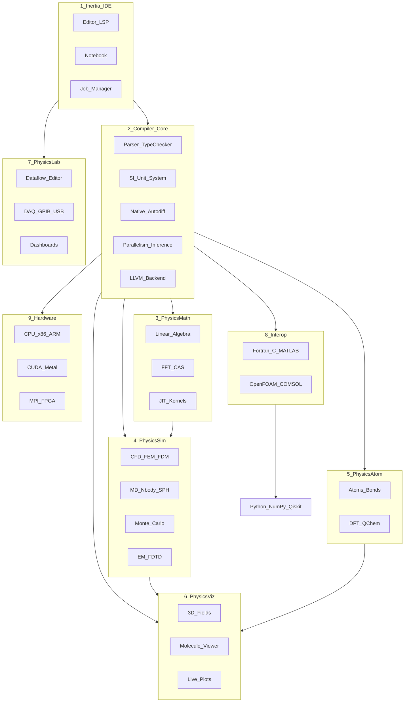

# Inertia Architecture

Inertia is a standalone `.phys` compiled language with Python FFI, organized as a nine-layer stack.

## Layer diagram



## Compiler pipeline

```
.phys source
  → Lexer + Parser (physlang-parser)
  → Type check + SI units (physlang-types)
  → MIR + autodiff (physlang-mir)
  → LLVM IR (physlang-llvm) OR Interpreter (physlang-runtime)
```

## Crate map

| Crate | Layer | Status |
|-------|-------|--------|
| `physlang-parser` | Compiler | Phase 0 |
| `physlang-types` | Compiler | Phase 0 |
| `physlang-mir` | Compiler | Phase 0–1 |
| `physlang-llvm` | Compiler | Phase 0 (pseudo-IR) |
| `physlang-runtime` | Math/runtime | Phase 0–1 |
| `physlang-quantum` | Atom/quantum | Phase 1 |
| `physlang-viz` | Viz | Phase 1 |
| `physlang-lsp` | IDE | Phase 1 |
| `physlang-cli` | IDE | Phase 0 |
| `physlang-py` | Interop | Phase 1 |

## Design decisions

- **Standalone `.phys`** with Python FFI (not embedded DSL)
- **First MVP vertical:** quantum computing (Qiskit / PennyLane)
- **PhysicsLab** is a separate IDE extension (Phase 5)
- **PhysicsOS** deferred indefinitely

See [Todo.md](../Todo.md) for the full implementation roadmap.
